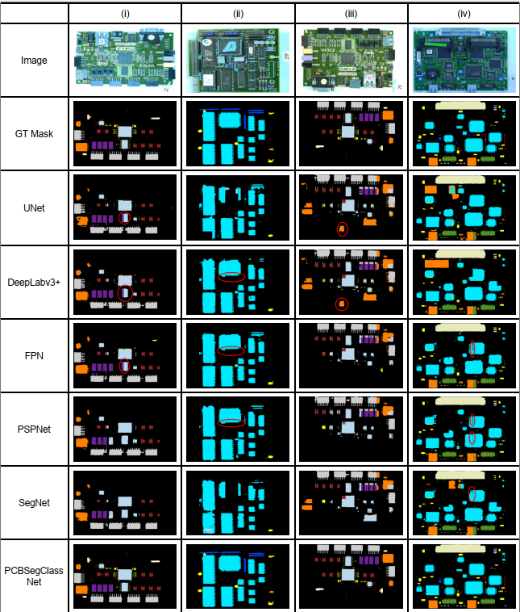

PCBSegClassNet - A Light-weight Network for Segmentation and Classification of PCB Component
==============================

## Overview:

This repository contains the source code of our paper, PCBSegClassNet (Under review for publication in <a href="https://www.sciencedirect.com/journal/expert-systems-with-applications">Expert Systems With Applications</a>).

We present PCBSegClassNet, a novel deep neural network for PCB component segmentation and classification. We perform segmentation on the whole PCB image and classification on the individual component images. We design a novel two-branch network for achieving high segmentation and classification performance.

## Flow of network


<hr>

Project Organization
------------
    ├── LICENSE                         <- The LICENSE for developers using this project.
    ├── README.md                       <- The top-level README for developers using this project.
    ├── data
    │   ├── segmentation                <- The segmentation format data for training segmentation model.
    │   |   |── train
    |   |   |   |── images              <- The training images directory where all patches of images will be stored.
    |   |   |   |   └── image_0.png
    |   |   |   |   └── image_1.png
    |   |   |   |   └── ...
    │   |   |   └── masks               <- The training masks directory where all patches of masks will be stored.
    |   |   |   |   └── image_0.png
    |   |   |   |   └── image_1.png
    |   |   |   |   └── ...
    │   |   |── val
    |   |   |   └── images              <- The validation images directory where all patches of images will be stored.
    |   |   |   |   └── image_0.png
    |   |   |   |   └── image_1.png
    |   |   |   |   └── ...
    │   |   |   └── masks               <- The validation masks directory where all patches of masks will be stored.
    |   |   |   |   └── image_0.png
    |   |   |   |   └── image_1.png
    |   |   |   |   └── ...
    │   ├── classification              <- The classification format data for training classification model.
    │   |   |── train
    |   |   |  └── <CLASS_NAME>         <- directory with name of the classname (i.e., R, C, IC, ...).
    |   |   |   |   └── image_0.png
    |   |   |   |   └── image_1.png
    |   |   |   |   └── ...
    ├── requirements.txt                <- The requirements file for reproducing the analysis environment, e.g. generated with `pip freeze > requirements.txt`.
    |── reports                         <- The directory containing metadata used for repo.
    ├── checkpoints                     <- Directory where best models will be saved.
    ├── src                             <- Source code for use in this project.
    │   ├── data                        
    │   │   └── dataloader.py           <- Source code for generating data loader.
    |   ├── cfs
    │   │   └── pscn_class.yml          <- basic configurations for classification training of PCBSegClassNet model.
    │   │   └── pscn_seg.yml            <- basic configurations for segmentation training of PCBSegClassNet model.
    │   ├── models
    │   │   ├── blocks.py               <- Source code for the individual blocks used for creating network of PCBSegClassNet.
    │   │   └── network.py              <- Source code for the PCBSegClassNet network for both segmentation and classification task.
    |   |   └── loss.py                 <- Source code for proposed DIS Loss and other metrics used for evaluation.
    │   |── utils
    |   |   └── options.py              <- Source code for parsing yaml file.
    |   └── train_classification.py     <- Source code for training and testing of classification network.
    |   └── train_segmentation.py       <- Source code for training and testing of segmentation network.
    └────────────────────────────────────────────────────────────────────────────────────────────────────────────────────────────────────
------------

<hr>

## Network Architecture


<hr>

## Sample Results



<hr>

## Get Started

Dependencies:

```bash
pip install -r requirements.txt
```
### (Optional) Conda Environment Configuration

First, create a conda environment
```bash
conda create -n pscn # python=3
source activate pscn
pip install -r requirements.txt
```

### Dataset

We have used FICS PCB Image Collection (FPIC) dataset which can be downloaded from <a href="https://www.trust-hub.org/#/data/pcb-images">here</a>. Data needs to be downloaded and placed under `data/` directory with format given in Project Organization. 

### Training Segmentation model

change the hyperparameters and configuration parameters according to need in ```cfs/pscn_seg.yml```.

To train pscn, Run following command from ```/src``` directory.

```bash
python train_segmentation.py -opt cfs/pscn_seg.yml -epoch 100
``` 
Above command will train segmentation model for 100 epochs with given configuration.

The trained checkpoint for model training will be saved in ```/checkpoints/best_seg.h5```

### Testing Segmentatin performance

To test pscn with trained model, Run following command from ```/src``` directory.

```bash
python train_segmentation.py -opt cfs/pscn_seg.yml -epoch 0
```

Above command will generate IoU Score, and DICE Score for segmentation output.

### Training Classification model

change the hyperparameters and configuration parameters according to need in ```cfs/pscn_class.yml```.

To train pscn, Run following command from ```/src``` directory.

```bash
python train_classification.py -opt cfs/pscn_class.yml -epoch 100
``` 
Above command will train classification model for 100 epochs with given configuration.

The trained checkpoint for model training will be saved in ```/checkpoints/best_class.h5```

### Testing Segmentatin performance

To test pscn with trained model, Run following command from ```/src``` directory.

```bash
python train_classification.py -opt cfs/pscn_class.yml -epoch 0
```

Above command will generate Accuracy, Precision, and Recall for classification output.

## Citation
```
@article {ref162,
	title = "PCBSegClassNet - A Light-weight Network for Segmentation and Classification of PCB Component",
	year = "2023",
	author = "Dhruv Makwana and R Sai Chandra Teja and Sparsh Mittal",
	journal = "Expert Systems With Applications",
}
```
## License
<hr>
CC BY-NC-ND 4.0